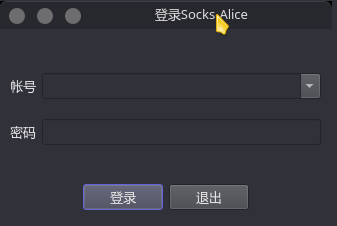
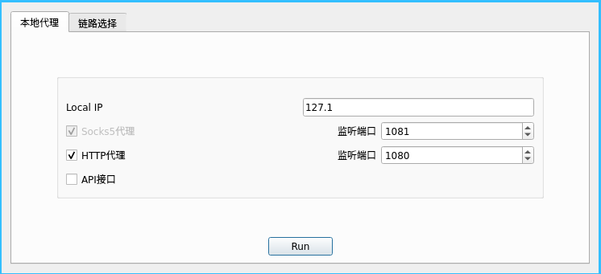
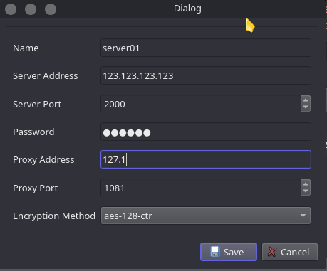

# SocksAB

## 编译与安装

### 手动编译安装

需要提前准备好密码学库botan2

如果用windows或mac，CMakeLists.txt需要修改/补充，TODO

```shell
mkdir build
cd build
cmake -DCMAKE_INSTALL_PREFIX=/usr ..
make
sudo make install
```

### 直接下载使用

可以直接从releases中下载对应系统的文件然后解压运行即可，依赖也跟着打包了

## 运行或测试

* 首先根据你的环境写好配置文件，配置文件保存在和Socks-Alice相同的路径
* 可以使用ssh在本地快速搭建一个socks5服务器，可以参考[利用ssh快速建一个socks5服务器用于测试](https://www.jianshu.com/p/1f34f944b081)
  * 如 `ssh -fND 127.1:2000 sky@localhost`

### Socks-Alice使用

我们根据自己的操作系统下载对应的客户端就行，也就是Socks-Alice

> 下载地址: https://github.com/sky-bro/SocksAB/releases

1. 双击Socks-Alice运行（windows先解压）

2. 一个登录窗口，是个假的，啥都不用输，直接回车就行

   

3. 两个tab，**本地代理**设置本地的ip和端口（最近了解到`127.1 == 127.0.0.1`），HTTP代理过几天就有了

   

4. **链路选择**就是添加服务器的，右键然后Add Server

   

   要连接某个服务器的话要把当前连接的那个服务器断开，右键对应的行就能看到Disconnect选项

   修改或是删除某个正连接着的服务器也要把它先断开

5. 添加了Server要运行，就右键对应的行，点connect（点完之后本地代理那儿会自动run的，点disconnect也会自动stop run）
6. 最后就是为自己的软件配置Socks5代理（http代理现在还不可用）

### Socks-Bob使用

```shell
❯ ./Socks-Bob/Socks-Bob -h
Usage: ./Socks-Bob/Socks-Bob [options]

Options:
  -h, --help         Displays help on commandline options.
  --help-all         Displays help including Qt specific options.
  -i, --ip <ip>      ip address of Socks-Bob
  -p, --port <port>  port of Socks-Bob
  -k, --key <key>    shared secret between Alice and Bob
```

## THINKG / TODO

* [ ] single instance
  * https://github.com/itay-grudev/SingleApplication
* crypto libraries
  * openssl
  * botan
    * libqtshadowsocks
  * crypto++
  * libsodium
* [ ] tanslation
* Socks-Bob无GUI，需要命令行参数解析
  * `--help` `-h` 查看帮助
  * `--key` `-k` Alice和Bob间的secret
  * `--ip` `-i` server绑定的ip地址 默认0.0.0.0
  * `--port` `-p` 绑定的端口 默认1082
  * [ ] `--method` `-m` 加密(通信)方式
  * `./Socks-Bob --ip 0.0.0.0 --port 1082 --key sky-io`
  * `nohup ./Socks-Bob -k sky-io > /dev/null 2>&1 &`
  * [ ] `--config` `-c` 也可读配置文件？
* Socks-Alice有GUI，并且使用配置文件
  * [ ] 其它配置文件路径? 如`/home/username/.config/SocksAB/config.txt`, `/etc/SocksAB/config.txt`
  * 使用ini文件
    * 本地监听的ip地址
    * Socks5代理 -- bool, 端口 -- ushort
    * HTTP代理 -- bool, 端口 -- ushort
    * 链路列表
      * 备注/名字, 入口ip:port, 代理出口ip:port, 密码, 加密方式method, 超时
      * 延迟/是否畅通, 当前是否连接此链路
* 添加Actions自动编译并发布
  * [x] linux
  * [ ] windows
  * [ ] mac
