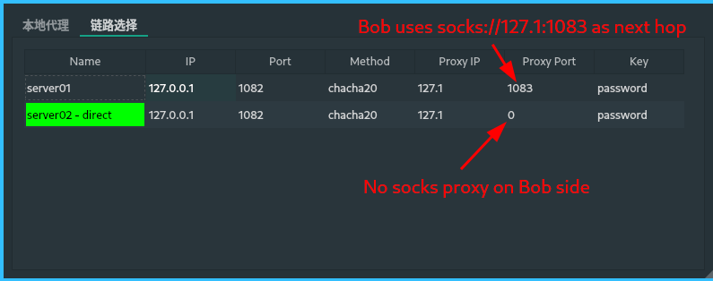

# SocksAB

[](https://github.com/sky-bro/SocksAB/actions/workflows/cmake.yml)

自己为了学习写的代理软件，持续改进中。

## 编译与安装

### 手动编译安装

首先需要安装[botan](https://github.com/randombit/botan)库，我使用的是2.17.3版本

使用下面命令编译安装，其实自己只是测试运行一下安装没有什么必要，要安装直接下release版本的就行

```shell
mkdir build
cd build
cmake ..
make
make install # 安装
```

### 直接下载使用

可以直接从releases中下载对应系统的文件即可，依赖也跟着打包了

## 基本原理

也是基于socks协议拆分成两部分, 所以中间客户端(Alice)到服务端(Bob)握手过程传输的内容和socks协议基本一样, 即包含host(ip或者域名)和端口信息。

所做的无非是对客户端到服务端的通信进行加密/混淆/伪装

### Socks-Alice使用

我们根据自己的操作系统下载对应的客户端就行，也就是Socks-Alice

> 下载地址: https://github.com/sky-bro/SocksAB/releases

1. 双击Socks-Alice运行（windows先解压）

2. 一个登录窗口，是个假的，啥都不用输，直接回车就行

   

3. 两个tab，**本地代理**设置本地的ip和端口（最近了解到`127.1 == 127.0.0.1`），支持Socks5/HTTP代理，两个端口不能冲突

   

4. **链路选择**就是添加服务器的，右键然后Add Server

   

   要连接某个服务器的话要把当前连接的那个服务器断开，右键对应的行就能看到Disconnect选项

   修改或是删除某个正连接着的服务器也要把它先断开

5. 添加了Server要运行，就右键对应的行，点connect（点完之后本地代理那儿会自动run的，点disconnect也会自动stop run）
6. 最后就是为自己的软件配置Socks5/HTTP代理

### Socks-Bob使用

Socks-Bob是我们的服务端，它是一个命令行程序，`-h`查看参数说明

```shell
> ./Socks-Bob/Socks-Bob -h
Usage: ./Socks-Bob/Socks-Bob [options]

Options:
  -h, --help         Displays help on commandline options.
  --help-all         Displays help including Qt specific options.
  -i, --ip <ip>      ip address of Socks-Bob
  -p, --port <port>  port of Socks-Bob
  -k, --key <key>    shared secret between Alice and Bob
```

## 运行测试

* 可以使用ssh在本地快速搭建一个socks5服务器，可以参考[利用ssh快速建一个socks5服务器用于测试](https://www.jianshu.com/p/1f34f944b081)
  * 如`ssh -ND localhost:1083 sky@localhost`(增加`-f`参数可以在后台运行)
  * Socks-Bob的下一跳可以是一个Socks代理(或者直接访问目标网站)
* 运行Socks-Bob
  * 如`Socks-Bob --port 1082 --key "password" --method chacha20`
* 运行Socks-Alice, 添加链路, 如
  

## THINKG / TODO

* [ ] 同时只能运行一个实例
  * https://github.com/itay-grudev/SingleApplication
* 密码库的选择
  * openssl/libcrypto
  * [x] botan
    * libqtshadowsocks
  * crypto++
  * libsodium
* [ ] 中英文支持
* Socks-Bob无GUI，需要命令行参数解析
  * `--help` `-h` 查看帮助
  * `--key` `-k` Alice和Bob间的secret
  * `--ip` `-i` server绑定的ip地址 默认0.0.0.0
  * `--port` `-p` 绑定的端口 默认1082
  * `--method` `-m` 加密(通信)方式
  * `./Socks-Bob --ip 0.0.0.0 --port 1082 --key sky-io`
  * `nohup ./Socks-Bob -k sky-io > /dev/null 2>&1 &`
  * [ ] `--config` `-c` 支持配置文件
* Socks-Alice有GUI，并且使用配置文件
  * [ ] 配置文件路径? 如`/home/username/.config/SocksAB/config.txt`, `/etc/SocksAB/config.txt`
  * 链路列表
    * 备注/名字, 入口ip:port, 代理出口ip:port, 密码, 加密方式method, 超时
    * 延迟/是否畅通, 当前是否连接此链路
    * [x] 支持导入/导出配置
* [ ] 链路延迟检测
* 添加github actions自动编译并发布
  * [x] linux -- github action仅提供ubuntu18之后版本，没有16了，所以需要
  * [x] windows
  * [x] mac
